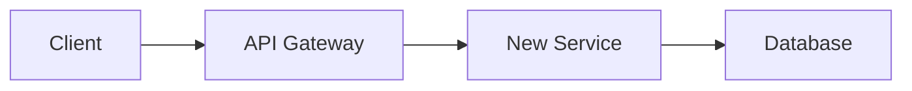

# RFC Template Reference

## Required Sections

Every RFC MUST include these sections to pass validation.

## Template

````markdown
# RFC: [Title]

## Metadata

- **RFC ID**: RFC-XXXX
- **Author**: [Name]
- **Status**: Draft | Review | Approved | Implemented | Rejected
- **Created**: YYYY-MM-DD
- **Reviewers**: [Names]

## Summary

One paragraph (100+ chars) summarizing what this RFC proposes and why.
This should be understandable to someone who hasn't read the full document.

## Background

Why is this change needed? Include:

- Current state and its problems
- Data showing the impact (numbers required)
- Failed approaches or workarounds already tried
- What triggered this RFC

Example:
"Our API currently handles 10,000 requests/second. Load testing shows
we'll hit 25,000 rps by Q3 based on 40% MoM growth. Current architecture
caps at 15,000 rps before latency exceeds SLA. Three incidents in past
month traced to this bottleneck."

## Proposal

### Overview

Detailed description of the proposed solution.

### API Changes

```typescript
// New or modified endpoints
POST / api / v2 / resource;
{
  field: string;
  newField: number; // Added in this RFC
}
```
````

### Database Changes

```sql
-- Migrations required
ALTER TABLE resources ADD COLUMN new_field INTEGER;
CREATE INDEX idx_resources_new_field ON resources(new_field);
```

### Architecture



### Security Considerations

- Authentication/authorization changes
- Data exposure risks
- Audit logging requirements

## Alternatives Considered

### Alternative 1: [Name]

**Description**: Brief description of this approach.

**Pros**:

- Pro 1
- Pro 2

**Cons**:

- Con 1
- Con 2

**Why not**: Specific reason this wasn't chosen.

### Alternative 2: [Name]

[Same structure]

## Migration Plan

### Phase 1: Preparation

- [ ] Task 1
- [ ] Task 2
- Rollback: How to undo this phase

### Phase 2: Rollout

- [ ] Task 1
- [ ] Task 2
- Rollback: How to undo this phase

### Feature Flags

- `new_feature_enabled`: Controls new behavior
- Rollout: 1% -> 10% -> 50% -> 100% over 2 weeks

### Backward Compatibility

- Old API version supported for X months
- Data migration is reversible: Yes/No

## Risks

| Risk             | Probability  | Impact       | Mitigation          |
| ---------------- | ------------ | ------------ | ------------------- |
| Risk description | High/Med/Low | High/Med/Low | Mitigation strategy |

## Success Metrics

| Metric      | Current | Target | Measurement |
| ----------- | ------- | ------ | ----------- |
| Latency p99 | 500ms   | 200ms  | Datadog APM |
| Error rate  | 0.1%    | 0.05%  | Sentry      |

## Open Questions

- [ ] Question for reviewers?
- [ ] Decision that needs input?

## References

- Link to related RFC
- Link to design doc
- Link to relevant code

```

## Writing Effective Backgrounds

### Must Include
1. **Current state** with specific data
2. **Problem impact** (quantified)
3. **Why now** - what's the trigger

### Bad Examples
- "The system is slow" (no data)
- "Users complain about performance" (not specific)
- "We need to modernize" (no justification)

### Good Examples
- "Query latency increased 300% (from 50ms to 200ms p99) after data grew to 50M rows. This affects 15% of users who experience timeouts."
- "Authentication failures cause 2,500 support tickets/month ($125K support cost) and 8% trial abandonment."

## Alternative Analysis Framework

For each alternative, answer:
1. **What**: Brief description
2. **Pros**: 2-3 genuine advantages
3. **Cons**: 2-3 honest drawbacks
4. **Why not**: Specific reason it's not chosen

Don't include strawman alternatives. Each should be a genuine option someone could reasonably advocate for.

## Risk Assessment Matrix

| Probability | Impact | Priority |
|-------------|--------|----------|
| High | High | P0 - Block launch |
| High | Low | P1 - Fix before GA |
| Low | High | P1 - Have mitigation ready |
| Low | Low | P2 - Monitor |

## Common RFC Mistakes

1. **No data in background** - Always include numbers
2. **Single alternative** - Need at least 2 genuine options
3. **Vague migration plan** - Be specific about phases and rollback
4. **Missing rollback strategy** - Every change needs undo plan
5. **No success metrics** - Define how you'll know it worked
6. **Skipping security review** - Consider auth, authz, data exposure
```
